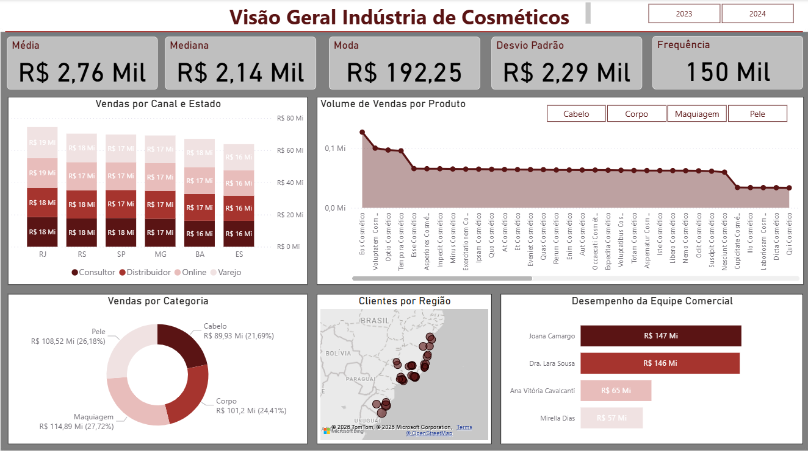

#  Análise de Mercado e Performance Comercial | Indústria de Cosméticos
####  Projeto de Análise de Dados com foco em Inteligência de Mercado
##  Preview do Dashboard

  

##  Visão Geral

Empresas do setor de cosméticos enfrentam desafios para compreender o desempenho de vendas em diferentes regiões, canais e categorias, especialmente na ausência de uma visão integrada dos dados.

Nesse contexto, este projeto foi desenvolvido para transformar dados operacionais em insights estratégicos que apoiem a tomada de decisão.

A ausência de uma visão consolidada dificulta a identificação de oportunidades de crescimento e gargalos operacionais.

Este projeto tem como objetivo analisar o desempenho comercial de uma empresa do setor de cosméticos, transformando dados operacionais em insights estratégicos para suporte à tomada de decisão.

A análise contempla múltiplas dimensões do negócio, incluindo canais de venda, categorias de produtos, regiões geográficas e performance da equipe comercial.

---

##  Objetivo do Projeto

Desenvolver um dashboard analítico no Power BI que permita:

- Monitorar o desempenho de vendas por região e canal  
- Identificar oportunidades de crescimento e gargalos operacionais  
- Avaliar a performance da equipe comercial  
- Analisar o comportamento de vendas por categoria de produto  

---

##  Stack e Metodologia

**Ferramentas utilizadas:**

* Power BI
* Power Query (ETL)
* DAX (criação de métricas e KPIs)

**Abordagem técnica:**

* Modelagem dimensional (Star Schema)
* Criação de tabela fato (vendas) e dimensões (clientes, produtos, vendedores e calendário)
* Desenvolvimento de KPIs como:

  * Receita total
  * Ticket médio
  * Mediana e moda
  * Desvio padrão
  * Ranking de vendedores

---
##  Decisões Analíticas

- Utilização de modelo estrela para garantir melhor performance e escalabilidade do modelo de dados  
- Criação de tabela calendário para permitir análises temporais consistentes e comparáveis  
- Uso de medidas estatísticas (média, mediana e desvio padrão) para reduzir impacto de outliers  
- Segmentação das análises por região, canal e categoria para identificar padrões de comportamento de negócio  
---

##  Principais Insights de Negócio

###  Performance Regional

O estado do Espírito Santo apresenta o menor volume de vendas e estabilidade ao longo do tempo, o que pode indicar baixa penetração de mercado, ausência de expansão comercial ou limitações na atuação dos canais na região.

Estados como RJ, SP e MG apresentam desempenho consistente e podem servir como benchmark estratégico.

##  Portfólio de Produtos

A categoria de maquiagem lidera as vendas, indicando forte demanda e potencial de expansão.

A categoria de cabelo apresenta menor participação, sugerindo oportunidade de crescimento ou reposicionamento.

##  Distribuição de Clientes

A forte concentração de clientes na região Sudeste sugere dependência regional, o que pode representar risco estratégico e oportunidade de expansão em mercados ainda não explorados.

Baixa penetração nas regiões Norte, Centro-Oeste e parte do Nordeste, indicando potencial de expansão.

##  Equipe Comercial

Diferenças relevantes de produtividade entre equipes sugerem possíveis variações na gestão, maturidade dos times ou perfil das carteiras de clientes.

Identificação de líderes com alta performance por vendedor, sugerindo boas práticas replicáveis.

##  Recomendações Estratégicas

Expandir atuação em regiões com baixa penetração.

Testar estratégias comerciais baseadas em estados com melhor performance.

Desenvolver campanhas específicas para categorias com menor participação.

Replicar práticas das equipes mais produtivas.

##  Dashboard

O projeto inclui um dashboard interativo no Power BI com visualizações como:

Vendas por canal e estado

Vendas por categoria

Mapa de clientes por região

Performance da equipe comercial

##  Estrutura do Projeto
data/ → bases de dados (CSV)  
dashboard/ → arquivo Power BI (.pbix)  
docs/ → relatório técnico e apresentação  

##  Possíveis Evoluções

Implementação de modelos preditivos de vendas

Segmentação avançada de clientes (clusterização)

Automação de atualização de dados

Deploy em ambiente cloud

##  Sobre

Profissional com sólida capacidade analítica e experiência na construção de dashboards, análise de indicadores e geração de insights estratégicos.

Atuação voltada à transformação de dados em informação para suporte à tomada de decisão, com domínio de ferramentas como Power BI, SQL e Python.

Interesse em atuar em ambientes orientados a dados, especialmente em áreas como Analytics, Inteligência de Mercado e setor financeiro.
